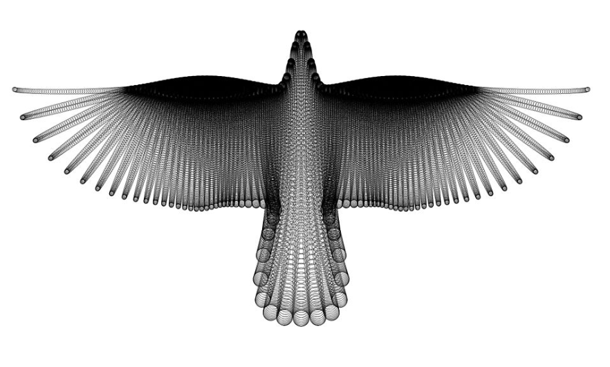
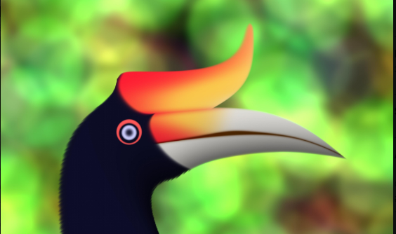

# Digital Native NFTs

## About 
This is a PoC to introduce a novel approach to creating NFTs. The aim is to have every NFT derived from only geometric objects. You can use these geometric elements to draw anything from cars to birds. We choose to call these drawings Digital Native NFTs ( DNNs ). Using these shapes means we can't use images - whatever digital object we are building must have been built from scratch within a digital environment i.e. **natively**.

**Note:** The restriction regarding the use of geometric elements pertains to structure. You can of course use color & other properties like motion in your NFT objects. 

The aim of this approach is that the objects drawn are **alive digitally**. Therefore, they can possess properties that we can exploit. This opens up several possibilities that wouldn't be possible if we used images as most creators normally do. See the Use Cases section 

# Motivation 
Most of the current NFTs are from the real world. They have no actual presence in the digital world. The properties that they possess are not native to the setting in which they are portrayed i.e. the digital setting.

This leads to several challenges:

- It restricts innovation in the NFT space. This is because the given objects lack inherent digital properties that can be exploited in meaningful ways within the context they're portrayed. 

- We are unable to subdivide or fractionate the objects in meaningful ways 

- Drawings speak to a story. When we just export images ( without a meaningful mapping in the current setting), some value in the story is lost.

- The objects are unable to interact with each other in novel & exciting ways 

- Fair pricing, especially if fractionalized is difficult 

See the drawing below:

If you found this image on a Marketplace like Opensea and the creator was asking for 5 ETH, your new question would be: HOW?

Let's say we told you that it was the work of the mathematical artist, [Hamid Naderi Yeganeh](https://twitter.com/naderi_yeganeh?lang=en). Additionally, that he used the mathematical equations below, you'd now want a piece of the pie. You can have a fraction or the whole :)

Now, let's say we created a 3D model of it & anyone who wants to see it dance pays a small fee - Ah!

Hope you now see where we're getting at!

## Tools 
To generate our drawings (i.e. DNNs ),  we will need two tools:

- A Javascript client-side library called [p5.js](https://www.npmjs.com/package/p5) for creating visual media. This library is based on the Processing software, an industry-standard software used by visual artists. 
- A local Javascript server. Many options to choose from. You can use [Live Server extension for VS Code](https://marketplace.visualstudio.com/items?itemName=ritwickdey.LiveServer). Here's how you can set it up. 
- [Puppeteer](https://pptr.dev/). A Nodejs library that will enable us run a headless browser in at the backend (node)

In case for some reason you don't want to set up the first two on your local environment, you can always use the [p5.js web editor](https://editor.p5js.org/). 

## Design
### Fractionalization 
First, let's begin with the whole. Each drawing is encapsulated within a canvas. A canvas defines the size of the drawing i.e. its bounds. 

Within a canvas, we have a **drawing(s)**. A drawing can be split into **fractions** by the **creator**. 

A fraction is a **discrete** entity within a drawing.

### Ownership 
A fraction can be owned by at most 1 account. A drawing can be owned by more than one account if it has at least 2 fractions.

### Intersection 

Fractionalization presents some challenges with ownership, particularly when it comes to asset transfer. How do we know that the fractionated part isn't a part of another fraction?

You can equate this problem to double-spending in fungible tokens. 
To ensure malicious creators aren't reselling the same fraction, validators check that there's no **area intersection** of the fraction with any other fraction. 

### Interactivity 
Two or more DNNs can be merged in a deterministic way. Possible applications for this are collaborative art and consolidation of assets. 

Note: The creators/collectors need to use their discretion while making such combinations. 

## Use cases 

- Fractional NFTs 
- New revenue streams. Asset owners can charge for public showcasing or for allowing other NFTs to interact with theirs. Think digital museums and fans’ NFTs meeting celebrity NFTs 
- Fractional/complete transfer of digital assets
Predictable pricing models
- Digital objects can be translated into physical objects e.g. if your NFT is a 3D model

## Usage 
See example directory 

## Future development 
Note: this is a community project & your contribution is not only welcome but also needed:)

We need application-level standards. 

- Customize the Processing version the nodes will use e.g. remove support for images. The API should only support geometric objects. 
- Standards for DNN tokens e.g. for pricing 
- Private transfer/creation of DNNs

Endgame: Launch to Cartesi mainnet

## References 

[Collision Detection](https://happycoding.io/tutorials/processing/collision-detection) 
[Hamid Naderi Yeganeh](https://twitter.com/naderi_yeganeh?lang=en)
